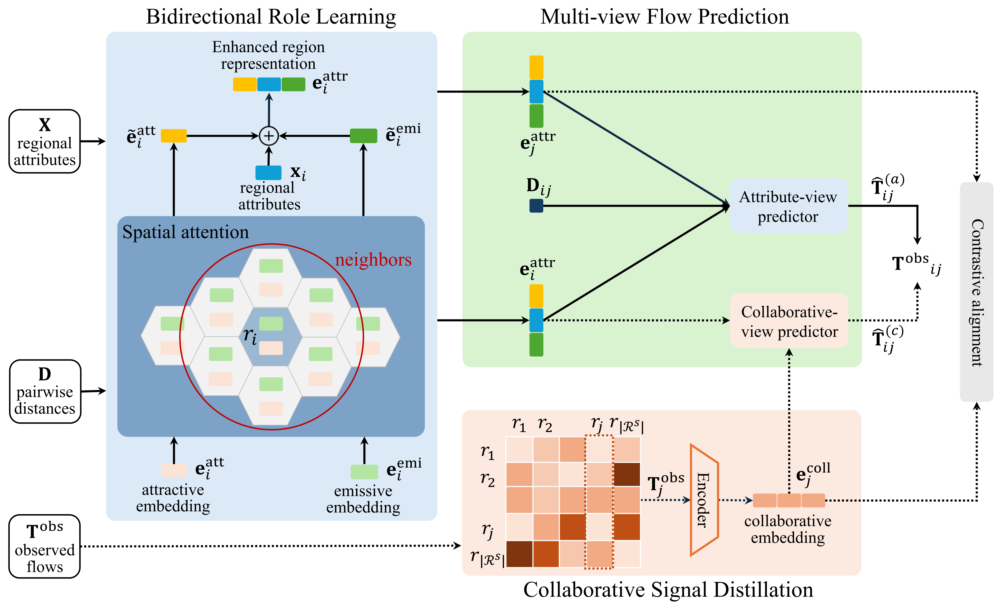

# RACE

**RACE: Role-Aware Collaborative Embedding for Cold-Start Commuting Flow Prediction**

This repository contains the official implementation of **RACE**, a role-aware and collaborative embedding framework for urban commuting flow prediction under cold-start settings.

RACE explicitly models asymmetric regional roles (origin vs. destination) and distills collaborative signals from the OD matrix into attribute-based representations, enabling accurate flow prediction for unseen regions.


### Model Framework
<p align="middle" width="100%">
  
</p>

### Configurations
 For all datasets, we train RACE using the Adam optimizer with a learning rate of 1e-3 and a weight decay of 1e-5 for up to 200 epochs with early stopping (patience = 10) and a batch size of 16, where the embedding dimensions are set to d_r = 48 (Attractive/Emissive), d_c = 48 (Collaborative), and d = 48.


### Requirements
The runtime environment can be viewed in requirements.txt or by executing the following command:
```shell
pip install -r requirements.txt
```

### Run
#### The following is a run of New York City Dataset (San Franscio and Washington DC is similarly provided):

- For RACE model:
  ```shell
  python ./model/main.py --dataset NYC --embed_dim 48 --neighbor_k 30
  ```
